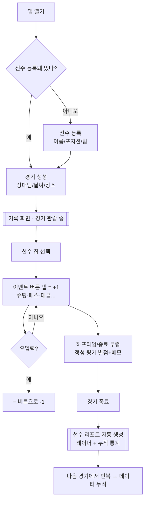
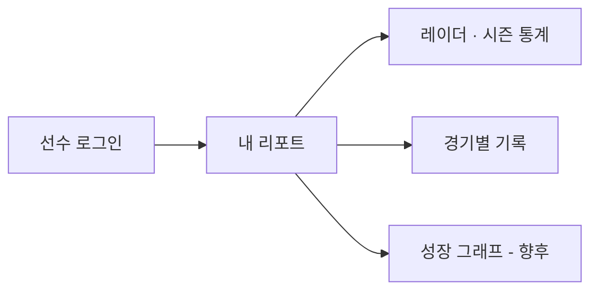
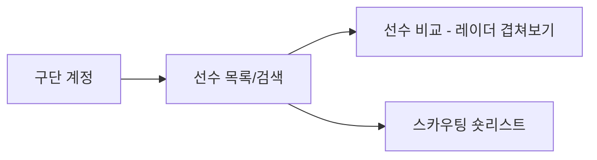

# 02. 유저 플로우

기획서의 사용자는 3명(에이전트/선수/구단)이지만, **본질을 만드는 사람은 에이전트 하나**입니다.
선수·구단은 "에이전트가 만든 데이터를 열람"하는 소비자일 뿐이므로 MVP에서는 **에이전트 플로우에 올인**합니다.

## 1. 핵심 플로우 — 에이전트 (경기 하나를 기록하는 여정)

### 이 플로우의 설계 의도
- **등록은 최초 1회만** — 두 번째 경기부터는 "경기 생성 → 기록 → 종료"만 반복.
- **기록 화면이 홈** — 앱을 켠 목적의 90%가 기록이므로 가장 빠르게 도달.
- **탭 = +1, 롱프레스/− = -1** — 입력·되돌리기 외의 인터랙션을 제거해 경기 집중 유지.
- **종료 = 확정** — 종료해야 통계에 반영. "기록중" 경기는 언제든 이어서 탭 가능.

## 2. 선수 플로우 (열람자 · MVP에서는 읽기 전용)

> MVP에서는 별도 앱을 만들지 않고, 에이전트가 만든 **리포트 화면을 링크로 공유**하는 수준이면 충분.

## 3. 구단 플로우 (향후 Phase 4)

## 4. 화면 지도 (MVP에 실제로 존재하는 화면)

| 화면 | 역할 | 프로토타입 |
|---|---|---|
| 선수 목록 | 선수 + 종합 가치 점수 한눈에 | `screenPlayers` |
| 선수 등록 | 최초 1회 | `screenAddPlayer` |
| 경기 목록 | 진행중/종료 경기 | `screenMatches` |
| 경기 생성 | 상대팀 등 최소 정보 | `screenAddMatch` |
| **기록 화면** | ★ 탭 기반 실시간 기록 | `screenRecord` |
| 정성 평가 | 별점 8종 + 메모 | `screenEval` |
| **선수 리포트** | ★ 레이더 + 누적 통계 | `screenReport` |

★ 두 화면이 본질. 나머지는 이 둘로 가기 위한 최소 경로.
