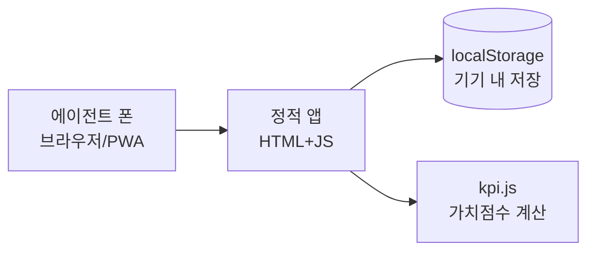
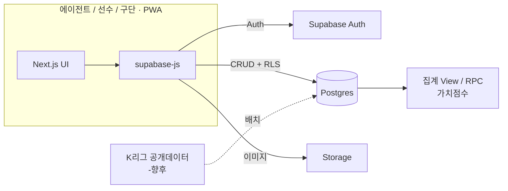
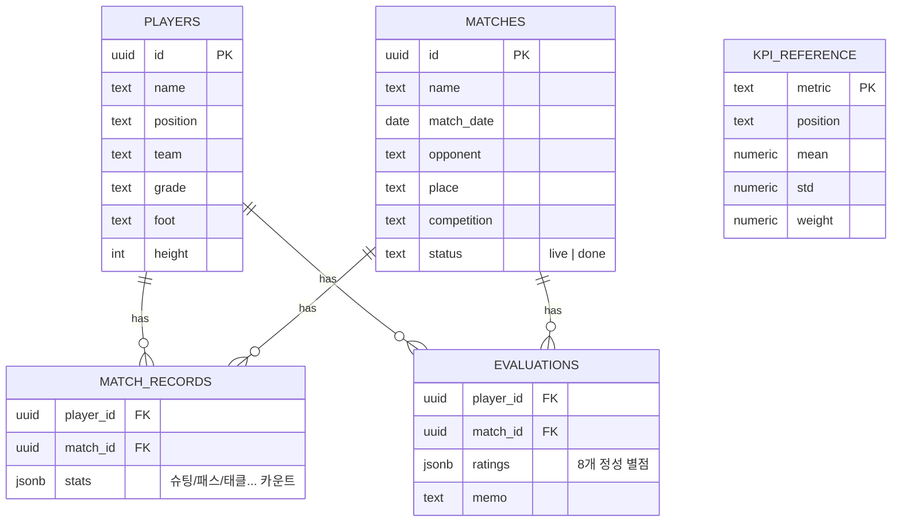

# 04. 기술 아키텍처

> 원칙: **오버엔지니어링 금지.** "에이전트 1명이 경기 기록해서 리포트 본다"에 필요한 만큼만.

## 1. 기술 스택 (단계별)

| 항목 | Pilot (지금) | 프로덕션 (다음) | 선택 이유 |
|---|---|---|---|
| 클라이언트 | 정적 HTML/CSS/JS + PWA | **Next.js(React) + PWA** | 앱스토어 없이 "홈화면 추가"로 앱처럼. 웹 하나로 iOS/Android 커버 |
| 상태/데이터 | localStorage | **Supabase(Postgres)** | 무료 티어로 Auth+DB+Storage 한 번에. 서버 운영 0 |
| 인증 | 없음(단일 사용자) | Supabase Auth (매직링크/카카오) | 소규모에 서버리스 인증이 가장 저렴 |
| 배포 | 정적 호스팅(Vercel/Netlify/GitHub Pages) | Vercel | Git push = 배포 |
| 점수 계산 | 클라이언트(`kpi.js`) | 동일 로직 공유(추후 무거워지면 Edge Function) | 계산이 가벼워 클라에서 충분 |

**왜 처음부터 Firebase/AWS/전용 백엔드가 아닌가?**
사용자 1~수십 명 규모에서 서버·컨테이너·ORM은 전부 비용(시간·돈)입니다.
Supabase 하나면 DB·인증·파일·API가 끝나고, Pilot 단계는 그마저도 없이 localStorage로 검증합니다.

## 2. 시스템 모식도

### Pilot (백엔드 없음)

### 프로덕션 (Supabase)

## 3. 데이터 모델 (Postgres 기준, `store.js`와 1:1)

### 설계 포인트
- **이벤트 단위가 아니라 "선수×경기 = 1행" 집계 저장.**
  탭할 때마다 이벤트 로그를 쌓으면 테이블이 폭발합니다. `stats`를 JSONB 카운터로 두고 +1/-1만.
  (타임라인·되돌리기 히스토리가 필요해지는 순간 `match_events` 테이블을 추가하면 됨 — 지금은 불필요.)
- **KPI_REFERENCE는 데이터, 코드가 아님.** 리그 평균/표준편차/가중치를 테이블로 빼서 **운영 중 재보정**.
- **집계 = View 또는 RPC.** 선수 리포트는 완료 경기의 `stats`를 SUM한 뒤 `kpi.js`와 동일 공식으로 T-score 산출.

## 4. 소규모 서버 저장 전략 (질문 핵심)

| 규모 | 저장 방법 | 비용 | 비고 |
|---|---|---|---|
| 1명(개발/데모) | **localStorage** | 0 | 지금 프로토타입 |
| ~수십 명 | **Supabase 무료 티어** (500MB DB) | 0 | JSONB 집계라 용량 매우 작음 |
| ~수천 명 | Supabase Pro ($25/mo) | 저 | 그때 가서 |

> 유소년 경기 데이터는 "경기당 한 줄"이라 **극도로 가볍습니다.**
> 선수 100명 × 30경기 = 3,000행 × 작은 JSON. 무료 티어로 수년 버팁니다. 서버 증설 걱정은 시기상조.

## 5. 마이그레이션 경로 (localStorage → Supabase)

`store.js`의 함수 시그니처(`players()`, `addMatch()`, `tally()`, `aggregate()`)를 그대로 유지하고
내부 구현만 `supabase-js` 호출로 교체하면 화면 코드는 **무수정**. 데이터 계층을 얇게 추상화해 둔 이유입니다.
