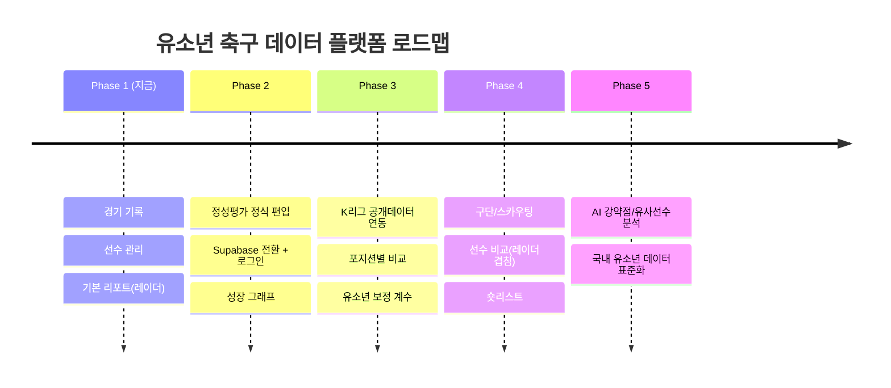

# 06. MVP 범위와 로드맵

## 1. MVP(Pilot) 범위 — 딱 이만큼만

기획서 §15를 그대로 따릅니다. **핵심 루프 하나**를 완성도 있게.

### ✅ 포함 (프로토타입에 이미 구현됨)
- [x] 선수 등록 (이름/포지션/팀/학년/신체)
- [x] 경기 생성 (상대팀/날짜/장소/대회)
- [x] **클릭 기반 경기 기록** (21종 이벤트, 탭=+1, −=취소)
- [x] 다중 선수 전환 기록 (선수 칩)
- [x] 경기 종료 → 통계 확정
- [x] 정성 평가 (8개 별점 + 메모)
- [x] 선수 통계 (시즌 누적)
- [x] **선수 리포트 (가치점수 레이더 + 계산 근거)**

### ❌ 제외 (의도적으로 나중에)
- AI 분석 / 외부 데이터 연동 / 랭킹 / 공개 서비스 / 구단 관리 / 로그인·다중계정

> 로그인조차 Pilot에선 뺐습니다. "에이전트 1명, 내 기기"면 검증에 충분하고,
> 붙이는 순간 Supabase Auth로 30분이면 됩니다. 지금은 **핵심 루프 검증**이 유일한 목표.

## 2. 로드맵 (기획서 §16 Phase와 정렬)

## 3. 단계별 "그때 추가할 것" 체크포인트

| 트리거 (이게 생기면) | 그때 추가 |
|---|---|
| 사용자가 2명 이상 / 기기 여러 대 | 로그인 + Supabase 전환 |
| 경기 타임라인·순간 복기 필요 | `match_events` 이벤트 로그 테이블 |
| "다른 선수랑 비교" 요구 | 레이더 겹쳐보기 · 비교 화면 |
| 데이터 수백 경기 누적 | AI 강약점/성장 분석 |
| 외부 노출 필요 | 랭킹·공개 리포트 + 권한 관리 |

## 4. 지금 당장 다음 할 일 (프로토타입 이후)

1. 실제 에이전트 1명에게 **한 경기 기록 시켜보기** (가장 중요한 검증).
2. 피드백으로 **버튼 구성·라벨** 다듬기 (포지션별 프리셋).
3. 반응 좋으면 Supabase 붙여 **여러 기기 동기화**.
4. K리그 기준값을 유소년에 맞게 1차 보정.

> 개발을 더 하기 전에 **현장 검증 1회**가 어떤 기능 추가보다 가치 있습니다.
